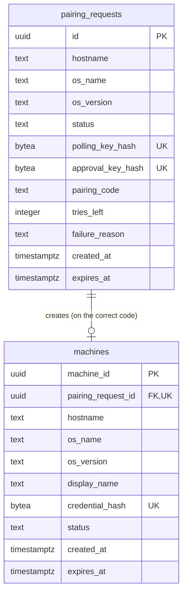
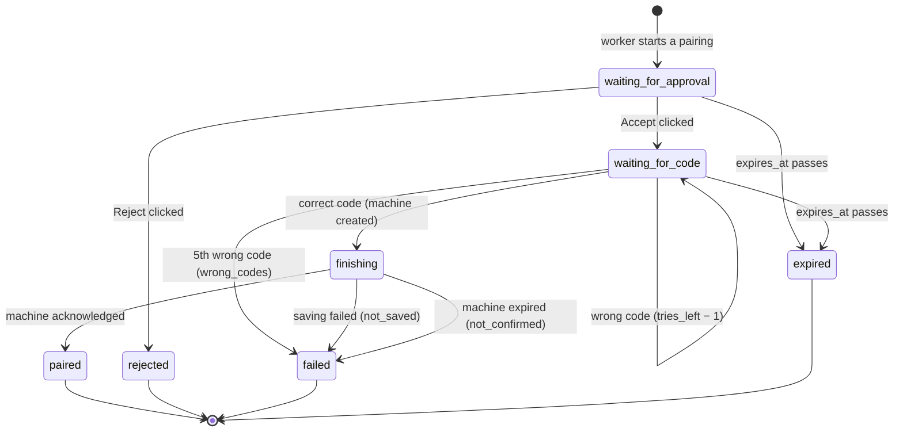
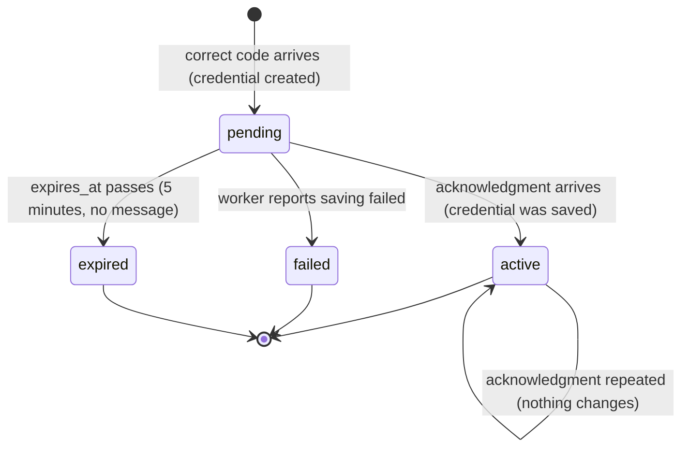

# Data model

Everything tervi stores: the server's database tables and the worker's local
data. This file lives across slices; each slice's plan pull request updates
it. The HTTP contract is in [`api/openapi.yaml`](../api/openapi.yaml).

**Source of truth.** For the database, the migration files in
`internal/server/db/migrations/` are the truth; this file explains them and
must agree with them. For the worker's local data, this file is the truth.

## Server database



A pairing request creates at most one machine. A machine always belongs to
exactly one pairing request.

### `pairing_requests`

One row per pairing attempt. Added by slice 0001 (migration `0001`).

| Column | Type | Rules | Meaning |
| --- | --- | --- | --- |
| `id` | `uuid` | primary key, generated | The pairing request's ID |
| `hostname` | `text` | not null, default `''` | As reported by the worker; may be empty; at most 64 characters (checked by the API) |
| `os_name` | `text` | not null, default `''` | As reported by the worker; may be empty; at most 64 characters |
| `os_version` | `text` | not null, default `''` | As reported by the worker; may be empty; at most 32 characters |
| `status` | `text` | not null, one of the lifecycle states below | Where the attempt is |
| `polling_key_hash` | `bytea` | not null, unique | SHA-256 of the polling key; the key itself is never stored |
| `approval_key_hash` | `bytea` | not null, unique | SHA-256 of the approval key; the key itself is never stored |
| `pairing_code` | `text` | null until Accept | The 8-digit code, stored as shown, for example `1234-5678`, so the page can show it again |
| `tries_left` | `integer` | not null, default `5` | Wrong codes still allowed |
| `failure_reason` | `text` | null, or `wrong_codes`, `not_saved`, `not_confirmed` | Set whenever the status becomes `failed` |
| `created_at` | `timestamptz` | not null, default `now()` | When the worker started |
| `expires_at` | `timestamptz` | not null | 10 minutes after creation; covers only the human steps |

#### Lifecycle

Boxes are the values of `status`. A state with no arrow out is final.



**Expiry is applied when read.** A row past `expires_at` may still say
`waiting_for_…` in the table; every query reads it as `expired` (and a
`finishing` row whose machine expired as `failed`). A clean-up job runs every
minute and writes those states into the table.

### `machines`

One row per paired computer. Added by slice 0001 (migration `0001`). Created
when the correct code arrives; it holds the credential's hash, which the
pairing request never does.

| Column | Type | Rules | Meaning |
| --- | --- | --- | --- |
| `machine_id` | `uuid` | primary key, generated | The machine's permanent ID |
| `pairing_request_id` | `uuid` | not null, unique, references `pairing_requests(id)` | The pairing that created this machine |
| `hostname` | `text` | not null, default `''` | Copied from the pairing request |
| `os_name` | `text` | not null, default `''` | Copied from the pairing request |
| `os_version` | `text` | not null, default `''` | Copied from the pairing request |
| `display_name` | `text` | not null | Starts as the hostname, or `unknown` when that is empty |
| `credential_hash` | `bytea` | not null, unique | SHA-256 of the credential; the credential itself is never stored |
| `status` | `text` | not null, one of the lifecycle states below | Where the machine is |
| `created_at` | `timestamptz` | not null, default `now()` | When the correct code arrived |
| `expires_at` | `timestamptz` | not null | 5 minutes after creation; matters only while `pending` |

#### Lifecycle



Each machine change also moves its pairing request out of `finishing`:
acknowledged → `paired`; saving failed → `failed` (`not_saved`); expired →
`failed` (`not_confirmed`). Both change in one transaction.

Only `active` machines exist for the user. A `pending`, `failed`, or
`expired` machine appears nowhere the user can see, and its credential is
accepted for nothing except acknowledging or reporting a failure while
`pending`.

## Worker local data

The worker keeps two things on the paired computer. Later worker versions
must still read both, so changing their format needs a migration plan of its
own.

### Secret store entry

One entry in the OS secret store (GNOME Keyring on Linux), service `tervi`,
user `worker`. Its value is JSON:

```json
{ "server": "http://localhost:8080", "credential": "<credential>" }
```

| Field | Meaning |
| --- | --- |
| `server` | The server that issued the credential, in standard form. **The only place the worker reads the server address from before sending the credential.** |
| `credential` | The machine credential. Secret. |

### `state.json`

`~/.config/tervi/state.json` (the user's configuration folder). Holds nothing
secret and no server address, so editing it cannot redirect the credential.

```json
{ "machine_id": "…", "credential_saved": true, "confirmed": true }
```

| Field | Meaning |
| --- | --- |
| `machine_id` | The machine this computer became |
| `credential_saved` | `false` from just before the secret store entry is saved; `true` once it was saved and read back |
| `confirmed` | `true` once the server answered OK to the acknowledgment |

The first write, `credential_saved: false`, comes **before** the secret
store entry is saved, so a stop at any moment leaves a note saying what was
about to happen. The later writes record what finished: `credential_saved:
true` after the entry was saved and read back, `confirmed: true` after the
server's OK.

## Names

| Name | What it is |
| --- | --- |
| Pairing request | The record of one pairing attempt |
| Approval key | The random key in the approval link `/pair/<approval key>` |
| Polling key | The worker's own key; it polls and submits the code with it |
| Pairing code | The code the browser shows and the user types into the terminal |
| Credential | The permanent proof the worker receives at the end |
| Machine | A paired computer, as the server records it |
