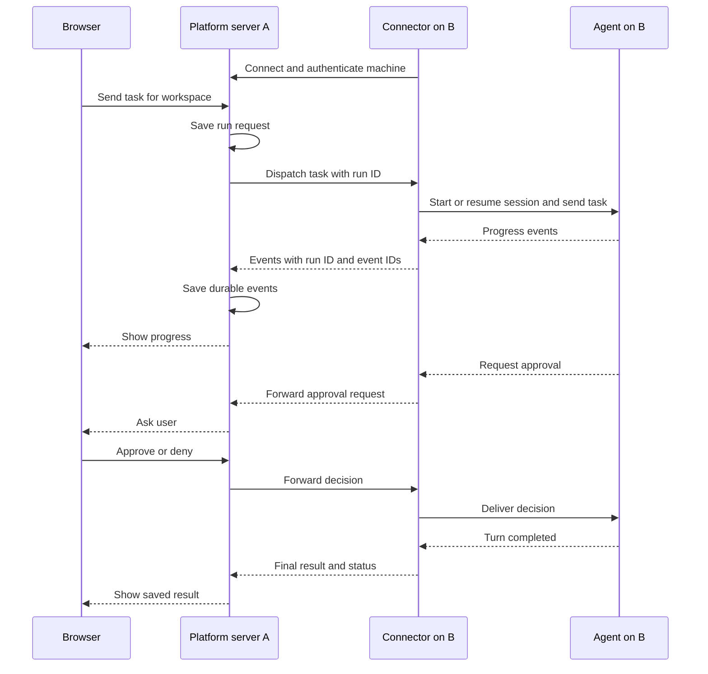

# 3. Agent Authentication and Remote Execution

This section describes how a user controls an agent working in an existing directory on their own computer. It continues the connected-directory arrangement from sections [1](workspaces.md) and [2](connections.md). Managed workspaces will have a separate setup flow.

The main idea is simple: the user signs into the agent on the work computer. Our connector launches and controls that agent there, then sends its progress to the platform server so the user can work through a browser.

## 3.1. Where each part runs

We use two computer names in the examples:

- **Computer A — platform server:** serves the website, manages connections, and saves conversations and run events.

- **Computer B — work computer:** holds the project directory, provider login, connector, and agent processes.

The browser can run on A, B, or another device. One platform server can connect to several work computers. Each work computer can have several registered directories.

| Component | Responsibility |
| --- | --- |
| Browser | Select a computer and workspace, send messages, view progress, answer approval requests, and stop work. |
| Platform server on A | Check access, route commands to the correct machine, save history, and stream updates to the browser. |
| Connector on B | Maintain the connection to A, report availability, and manage agent processes. |
| Provider adapter inside the connector | Translate platform commands into the selected agent's protocol and translate its events back. |
| Agent process on B | Read and edit project files, run tools, and communicate with its model provider. |
| Theia backend on B | Provide editing and terminal access to the same project directory. |

The agent's tools execute on B. Its model requests still go to the configured model provider; running locally does not mean the model itself runs on B.

## 3.2. Three separate kinds of authentication

| Authentication | What it allows | Where it belongs |
| --- | --- | --- |
| Platform login | Open the website and access the user's workspaces. | Platform server and browser session. |
| Machine pairing | Allow B's connector to communicate with A. | A separate, revocable connector credential on B. |
| Provider login | Allow the agent to use Codex or Claude services. | The provider's supported credential store on B. |

For the first version, the user installs the selected agent and completes its normal login directly on B. They should verify that it works locally before connecting it to the platform.

The connector runs under the intended OS user account, with access to that user's agent configuration and credential store. A background service running as another user, or inside a separate container, does not automatically inherit that login.

Our platform should display a provider status such as **Ready**, **Login required**, or **Unavailable**. Provider credentials should stay on B and should not be included in chat history, events, or project files. Pairing B with A does not require sending the provider's login token to A.

If authentication expires, show a clear instruction to sign in again on B. Do not repeatedly retry a task as if it were a connection error.

## 3.3. Connecting the work computer

The proposed setup flow is:

1. The user installs our native connector on B, making its command available on the user's `PATH` without requiring Docker or Docker Compose.

2. They run the command from any directory, choose to connect, and pair B with their platform account using a short-lived pairing flow, with browser assistance where needed.

3. The connector receives its own machine identity and credential.

4. The connector opens an authenticated outbound connection to A, using a secure WebSocket or equivalent transport.

5. A lists B as an available computer, including its name and connection status.

6. The user registers an allowed project directory on B as a workspace.

Because B starts the connection, the user normally does not need to expose a listening port on their work computer. A still needs to be reachable from B and the browser.

Run one background connector per work computer. It can manage multiple sessions, each linked to a workspace and directory. Starting another conversation does not require installing another connector.

## 3.4. Launching Codex through our wrapper

For Codex, the proposed adapter launches `codex app-server` on B and communicates with it through standard input/output. Codex documents this as a bidirectional JSON-RPC interface with commands, notifications, and approval requests. [Codex App Server](https://learn.chatgpt.com/docs/app-server)

The launch flow is:

1. The user selects a workspace and sends a message.

2. A records the run request and sends it to B's connector.

3. The connector checks that the workspace directory exists and is allowed.

4. The adapter starts or reuses an app-server process and completes its initialization handshake.

5. It creates or resumes the appropriate Codex thread, using the workspace directory as the working directory.

6. It starts a turn with the user's message.

7. It forwards progress, responses, and approval requests to A.

8. A saves durable events and updates the browser.

Keep the app-server connection private to the connector. Our platform's network connection is handled by the connector; the Codex process does not need its own public endpoint.

The adapter is a two-way controller. It must send approval responses and cancellation commands back to the agent as well as receive output. Use structured events so the UI can distinguish a response, a tool action, an approval request, and a completed turn.

## 3.5. Command and event flow

The browser can close while work continues, provided B and the relevant processes stay running. When the user returns, the browser loads saved history and reconnects to live updates.

## 3.6. Sessions, saved history, and connection loss

Keep these identities separate:

| Identity | Example purpose |
| --- | --- |
| Machine ID | Identify B even if its display name changes. |
| Workspace ID | Identify the registered project independently of its current path. |
| Conversation ID | Identify a chat in that workspace. |
| Run ID | Identify one submitted task or turn. |
| Provider session ID | Resume the matching Codex thread or other native agent session. |

Save the mapping between the platform conversation and the provider session. Saved chat text alone is not a guarantee that the provider can resume its native session; the required provider state must also remain available on B.

The proposed reliability rules are:

- Give commands and durable events stable IDs so retries do not create duplicate runs or messages.

- Buffer unsent events on B until A acknowledges them, subject to available disk space and operating-system limits rather than a platform-imposed storage quota. Section [11.7](recovery.md#117-queue-limits-and-long-outages) governs storage exhaustion.

- After reconnecting, reconcile the run state before dispatching work again.

- Show **Connection lost** when B is unreachable; do not assume the agent has stopped or finished.

- If B shuts down or the process crashes, retain the history and report the interruption. Resume only where the provider supports it.

Removing a workspace from the UI, deleting a directory, and deleting saved history are separate actions. A missing directory should block new execution without erasing earlier conversations.

## 3.7. How comparable products work

The following comparison records the documentation reviewed during this design discussion. Product implementations can change.

| Product | Relevant approach | What we take from it |
| --- | --- | --- |
| HAPI | A background runner launches agent sessions. CLI wrappers connect to a hub; the hub stores conversations and sends updates to clients. Multiple machines can connect to one hub. | Separate the central platform, machine connector, and agent session. |
| Happy | Local CLI wrappers launch Codex or Claude Code and connect sessions to web/mobile clients through an encrypted synchronization server. | Keep execution on the user's computer while providing remote control. |
| OpenHands Agent Canvas | A frontend can connect to several Agent Server backends. Those backends run conversations and can launch external agents through ACP adapters. | Separate the user interface from the machine that runs the agent. |

Sources: [HAPI installation and architecture](https://hapi.run/docs/guide/installation), [Happy repository](https://github.com/slopus/happy), [OpenHands Agent Canvas](https://github.com/OpenHands/OpenHands).

### How OpenHands handles external agents

OpenHands supports its own agent and external agents. Its ACP integration launches an agent adapter as a subprocess, sends messages through a common protocol, and renders returned events. The external agent handles its own model calls, tools, and execution.

Its documentation lists a Codex ACP adapter and says an existing provider login can be reused when accessible on the execution machine. Our initial Codex integration will instead use the native app-server interface directly. [OpenHands ACP agents](https://docs.openhands.dev/openhands/usage/agent-canvas/acp-agents)

OpenHands documents adding a backend using its URL and API key. Its self-hosting guide describes HTTPS access or an SSH tunnel. Our proposed connector instead initiates an outbound connection from B to A, so A becomes the common routing point. [OpenHands backends](https://docs.openhands.dev/openhands/usage/agent-canvas/backends), [Self-hosting guide](https://github.com/OpenHands/OpenHands/blob/main/docs/SELF_HOSTING.md)

These examples establish technical patterns. Provider-specific authentication support and terms must be checked for the chosen integration; another project's implementation is not evidence of provider approval.

## 3.8. Example user experience

Bert has the platform on A and a project at `/home/bert/projects/study-app` on B.

He signs into Codex on B, installs the connector, and pairs that computer. On the website, he sees **Work Desktop — Online**. He registers the directory as a workspace named **Study App**.

From another laptop, he opens Study App and asks, "Add a search box to the notes page."

A sends the task to B. The connector launches or reuses Codex, selects the correct workspace, and streams progress back. If Codex requests approval, Bert answers in the browser. Code changes remain in B's project directory, where Theia can also open them.

Bert closes the browser while the task runs. Later, he reopens the same workspace and sees the saved result. If B is offline, he can still read saved history, but new execution must wait until B reconnects.

## 3.9. Initial implementation scope

Start with a single-user flow that supports:

1. Pairing one or more work computers.

2. Registering allowed directories as workspaces.

3. Detecting whether Codex is ready on the selected computer.

4. Launching and controlling Codex through app-server.

5. Streaming responses, tool events, approvals, and completion status.

6. Saving history and reopening an existing conversation.

7. Handling disconnects without silently launching the same task twice.

Keep provider-specific code behind an adapter interface so Claude Code can be added with its own supported launch and authentication behavior. Keep the Theia backend separate from the agent adapter, while allowing both to use the same workspace files.
