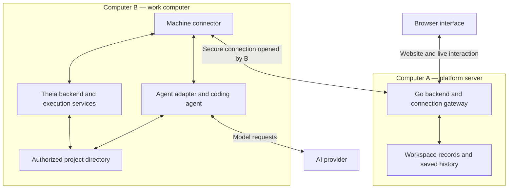
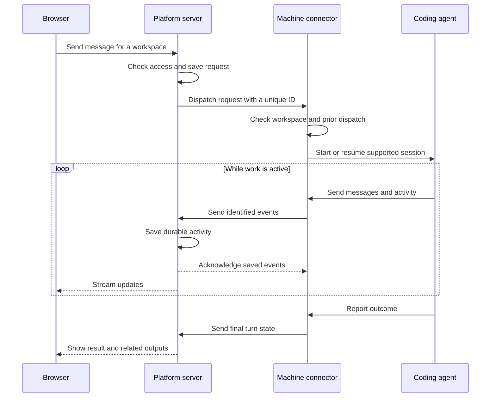
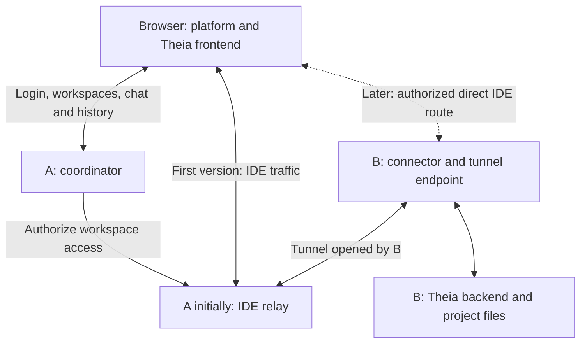
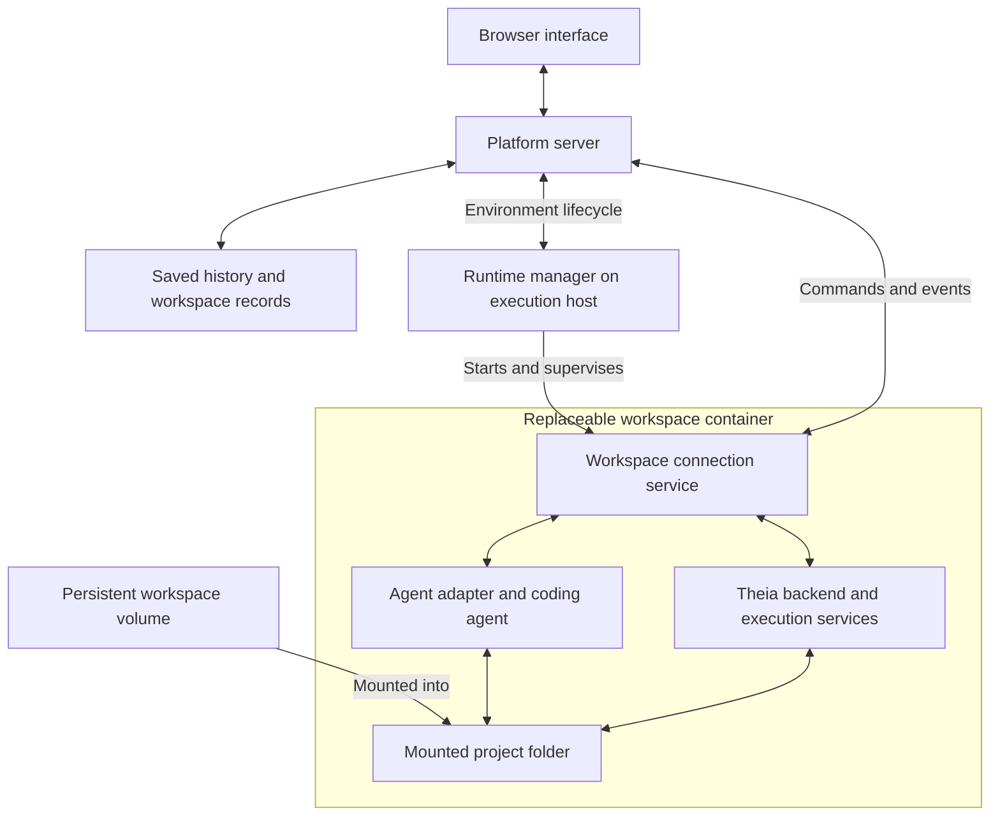

# 2. System Architecture and Machine Connections

The platform has three main parts: a browser interface, a platform server, and a service on each computer where work runs. Together, they let the user open a workspace, talk to an agent, edit files, and monitor work from another device.

These are separate responsibilities, but they do not require separate computers. A user can start with everything on one computer and connect additional machines later.
## 2.1. Main Components

| Component | Responsibility | Where it runs |
| --- | --- | --- |
| Browser interface | Shows workspaces, chat, the Theia editor, terminals, approvals, and results | In the user's browser |
| Platform server / coordinator | Handles access, workspace records, requests, saved history, and connections to work computers | On the computer hosting the platform |
| IDE relay / gateway | Proxies authorized IDE HTTP and WebSocket traffic without running project computation | Initially alongside the coordinator; separable later |
| Machine connector | Connects a work computer to the platform and supervises workspace services | On each work computer |
| Agent adapter | Translates platform requests and events to and from a supported coding agent | Beside the coding agent in the work environment |
| Coding agent | Inspects files, changes code, uses tools, and requests execution | In the workspace's work environment |
| Theia backend | Provides file access, terminals, language tools, debugging, and other IDE services | Near the workspace files, inside the authorized work environment |
| Execution service | Starts and tracks managed commands and background jobs | In the workspace's work environment |
| Persistent storage | Keeps workspace records, history, and any platform-managed files and artifacts | In storage that survives temporary process or container replacement |

The machine connector is ordinary platform software. It is separate from the AI coding agent and can remain connected even when no AI agent is running.

The coordinator and relay have separate responsibilities even when packaged together on computer A. The coordinator manages access and state; the relay carries live traffic. Agents, Theia backend services, and project computation run at the workspace execution location.

The central platform server and platform worker service are written in Go (see section [13](deployment.md)). Theia's backend runs on Node.js and supplies IDE services. It does not become a second owner of workspace identity, permissions, or agent history.

## 2.2. Connected Computer Architecture

In this example, Computer A hosts the platform. Computer B holds the user's project and runs the work. The browser can be on A, B, or another device.

The diagram shows responsibilities and communication paths. The connector may contain several modules; each box does not require a separate deployed service.

Computer A serves the frontend files, but the frontend code runs in the browser. Computer B runs the processes that need access to the project files.

The agent and Theia use the same authorized working directory. This lets the user inspect or continue the agent's work without transferring the project between separate editors.

File access staying on B does not mean that all information stays on B. Agent requests may send relevant code to the selected AI provider, and the platform stores the chat and activity it receives.

## 2.3. Connection Direction

The machine connector opens an outbound, authenticated connection from Computer B to Computer A. Once that connection exists, both sides can exchange messages through it.

This means the platform can send a request to B without requiring the user to open an incoming port on B. Computer A must still be reachable by both the browser and the connector, through the user's chosen network setup.

Feature 001 selects a secure WebSocket for the authenticated worker control connection, as defined in the `contracts/worker-control/` (not yet designed). Its initial protocol establishes the connection; later features add commands and events. IDE access also needs an authenticated tunnel or proxy that supports the HTTP and WebSocket traffic used by Theia, terminals, and previews. One physical connection is not required for all traffic.

The user should not have to expose separate public addresses for every terminal, agent, or Theia service. Access goes through the platform's authorized connection path.

For example, a user installs the platform on a personal server and connects a home desktop to it. They can then open the platform website from a laptop and work with the desktop's files. The desktop remains the machine doing the work.

### Multiple clients and concurrent operations

The same installation owner can use multiple browser clients simultaneously to access the same worker and its workspaces, for example from a phone and a Surface Pro. Each client authenticates to the central server independently. This is multiple sessions for one owner; it does not introduce multiple-user sharing or administration.

Opening a second client must not replace the first client's access, create another worker registration, or require another worker control connection. Relevant shared-state updates must reach all authorized clients viewing that state. Closing or losing one browser session must not disconnect another client or the worker, or stop eligible ongoing work.

Concurrent operations must preserve consistent shared state and prevent unintended duplicate execution or silent loss of accepted changes. Each affected feature must define how it handles simultaneous requests, stale client state, retries, and conflicting changes before implementation. The exact policies for simultaneous conversation messages, competing approval decisions, job requests, and file edits remain to be designed in their respective product sections and feature contracts; this requirement does not select a universal lock, queue, or last-write-wins policy.

This is a recorded product requirement for subsequent features, not an expansion of feature 001's pairing and connection-establishment acceptance scope. See [Multiple clients and concurrent operations in the architecture](../architecture.md#multiple-clients-and-concurrent-operations).

## 2.4. Adding a Machine

Connecting a new computer should be a short setup process:

1. The user installs the native machine connector on the work computer, making its command available on the user's `PATH`.

2. The user runs the command from any directory in a terminal and chooses to connect to a platform installation.

3. The command initiates a short-lived pairing flow, which may use a browser-assisted code or link.

4. They complete pairing and confirm which platform installation they are connecting to.

5. The platform assigns the machine a permanent ID and a separate device credential.

6. The user names the machine and authorizes the folders it may access.

7. The website shows the machine as online and makes its workspaces available.

The pairing code should expire after use or after a short period. The resulting device credential should be revocable from the website. A computer's display name and network address may change without changing its permanent ID.

The connector should support running in the background and reconnecting automatically. The user should not need to start it manually for every conversation.

The connector and required workspace components should be delivered through one setup experience. Theia and coding-agent processes can start when their features are needed, rather than keeping every workspace active all the time.

## 2.5. Connecting an AI Provider

There are two separate connections:

| Connection | What it authorizes |
| --- | --- |
| Machine connection | Allows a work computer to receive authorized requests from the platform |
| AI-provider connection | Allows a coding agent to use its selected provider |

For a connected-directory workspace, the initial design keeps provider credentials securely on the work computer. The user signs in through the provider's supported login method in the execution context that will run the agent.

The platform can show the provider name and connection state, such as **Connected**, **Login required**, or **Connection failed**, without receiving the raw provider token. Different providers may require different login and refresh behavior.

If the agent runs inside a container, the connector must arrange supported access to its credentials. A login in the host user's environment does not automatically make those credentials available inside every container.

For a managed workspace, the platform provides credentials to the intended execution environment from protected storage. Credentials must stay out of source repositories, container images, ordinary logs, and generated artifacts.

Switching agent providers should not require creating another workspace. However, preserving platform history does not guarantee that a different provider can resume the previous provider's internal session.

## 2.6. Sending a Message and Running Work

The platform should connect each request to a workspace, agent session, and turn. A turn is one user request and the agent activity caused by it.

The connector should remember dispatched request IDs so reconnecting does not blindly start the same work twice. If a failure leaves execution uncertain, the platform should show that uncertainty and reconcile it before retrying.

When the agent needs approval, it sends an approval request through the same platform path. The user's decision is recorded and returned to the correct waiting action. Agent work that requires a decision should wait until that decision can be received.

When the agent starts a managed run, the execution service owns that run's process, status, cancellation, and logs. The run can continue after the agent's current turn ends if its execution environment remains available.

## 2.7. IDE Connections: Relay First, Direct Access Later

The browser runs Theia's frontend. Theia's backend, language servers, terminals, and file operations run beside the workspace files on computer B or in the managed execution environment. The connection route is independent of the frontend layout. Section [#4](interface.md) selects a Theia-based application foundation.

### First version: central relay

The browser reaches the remote IDE through an authenticated relay on computer A. B opens an outbound tunnel to A, and the relay carries IDE HTTP and WebSocket traffic through that tunnel to the correct workspace service. Users do not need to expose separate incoming ports for Theia or each terminal on B.

The coordinator authorizes access and selects the workspace. The relay forwards live traffic; it does not perform project computation. Both can run in the same installation initially, with separate modules or connections where needed.

### Later: optional direct access with relay fallback

Add an optional direct browser-to-workspace IDE route when the execution endpoint is securely reachable. The coordinator continues to manage login, workspace identity, permissions, and chat/history. The IDE transport changes; the user remains in the same platform and workspace.

Direct access must enforce the same workspace and action boundaries as relayed access. Being able to reach a machine is not authorization. Browser-compatible HTTPS, authenticated connection establishment, origin rules, credential expiry/revocation, and network reachability require a concrete design before this option ships. Direct access is not assumed to work through every home router or firewall.

Retain the relay as the fallback when a direct route cannot be established. A failed live connection may require reconnection; do not promise seamless transport switching or replay arbitrary terminal input and file mutations. Preserve unsaved editor content and reconcile uncertain operations before retrying them.

A regional relay closer to users and execution computers is another future optimization when direct access is impractical. The initial installation does not require regional infrastructure.

The direct route terminates at an authorized gateway on B that forwards to Theia; it need not expose a bare backend publicly. The diagram shows logical roles, not mandatory separate deployments. For managed workspaces, the workspace service provides the equivalent execution-side endpoint.

### Keep live IDE traffic separate from durable events

| Traffic | Handling |
| --- | --- |
| Chat, approvals, meaningful actions, run status, and retained job logs | Save according to the workspace's history and retention rules |
| Editor requests, live terminal interaction, file transfers, and application previews | Proxy or route as live traffic; do not put every operation through the chat database or durable event queue |

Retaining managed-job output is distinct from recording every interactive terminal keystroke. Large transfers and noisy output must not block approvals or stop requests; use separate streams or connections as needed.

### Responsiveness and lifecycle

Typing and rendering occur in the browser. File opening, saving, backend-powered completion, debugging, and terminal responses depend on the network path. Relay distance and available bandwidth can affect these actions; agent streaming generally tolerates modest extra delay better than interactive IDE operations.

Measure end-to-end responsiveness for actual editor and terminal actions before deciding whether direct access or regional relays are needed. Do not assume that every relay is slow or that every direct route is faster.

Unsaved editor changes need conflict handling when an agent or external program changes the same file. Switching panels must not restart underlying work. Disabling the IDE disconnects its browser activity according to section [#4](interface.md); it does not stop agents or independent jobs. Direct IDE access does not imply direct agent-event delivery: agent commands and durable activity retain the coordinator path.

## 2.8. Managed Workspace Architecture

Managed workspaces keep the same platform interface and history model. The difference is that the platform creates the storage and execution environment instead of attaching to an existing user folder.

The runtime manager creates, starts, stops, and replaces environments. It also arranges the volume mount. The workspace connection service handles commands and events inside the running environment using the same platform concepts as the machine connector.

The runtime manager's ability to control containers must not be exposed to user programs inside the workspace. Stopping or replacing a container must leave the persistent volume and saved history intact.

The execution host may be the same computer as the platform server or a separate connected machine. The two workspace arrangements describe how files and execution are managed, not whether the computer is nearby or remote.

## 2.9. Persistence and Recovery

The platform stores the authoritative workspace records, conversations, approvals, and received run history independently of any coding-agent process.

The connector keeps a local record of pending events and active work. It retries unacknowledged events after reconnecting. Event IDs let the server recognize repeated deliveries without duplicating history.

| Interruption | Expected behavior |
| --- | --- |
| Browser closes | Work continues while its execution environment remains available |
| Connection to the server drops | The machine buffers activity within configured limits; work that does not need a new remote decision may continue |
| Platform server restarts | Connectors reconnect; saved history remains available and execution state is reconciled |
| Work computer shuts down | Its processes stop; retained files and activity support recovery, but arbitrary commands cannot be assumed resumable |
| Coding agent fails | Preserve its activity and show the failure without deleting the workspace |
| Managed container is replaced | Reattach persistent storage and rebuild the environment; unfinished programs may require a new run |

An offline machine should appear as **Disconnected**, with a last-update time. Its jobs must not be marked completed or failed solely because the connection disappeared.

## 2.10. Access Boundaries

Even the first single-user version needs authenticated machine pairing and protected browser access when used over a network.

Every routed request must identify its workspace and be checked against the authorized machine, folder, and action. An authorized connection to one machine must not become unrestricted access to every file or service on it.

Selecting a working directory is not itself a security boundary. Operating-system permissions or a sandbox must enforce any promised restriction on agent and tool access. The execution mode should make its actual access clear.

Coding agents, workspace extensions, and user programs must not receive the platform database credentials or unrestricted container-management access.

## 2.11. Installation and Initial Scope

The platform should support two installation patterns:

| Pattern | User experience |
| --- | --- |
| One computer | Install the platform and local execution components together, then open the website on that computer |
| Several computers | Install the platform once and pair additional work computers through the connector |

In both patterns, the user sees the same workspaces, agent activity, IDE, and saved history. The single-computer setup should not require the user to understand a distributed architecture.

The initial network design routes browser traffic through the platform installation, using the coordinator for application state and the relay for live IDE traffic. Section [2.7](connections.md#27-ide-connections-relay-first-direct-access-later) defines optional direct IDE access as a later phase with relay fallback. The same workspace and permission model applies to both paths; responsiveness should be measured before selecting an optimization.

The components should retain clear boundaries without requiring separate servers for each responsibility. Additional proxies, execution workers, and multi-user features can follow when needed.

## 2.12. Reference Platforms

These platforms informed the proposed design. Their exact protocols and features do not have to be copied.

- [Claude Code Remote Control](https://code.claude.com/docs/en/remote-control#connection-and-security) uses outbound connections from a local coding session, routes remote messages through its service, and stores transcripts while execution remains on the user's machine.

- [VS Code Remote Tunnels](https://code.visualstudio.com/docs/remote/tunnels) demonstrates remote IDE access through an authenticated tunnel, with a server component near the working files.

- [Coder architecture](https://coder.com/docs/admin/infrastructure/architecture) separates the central platform service from workspace agents. Its [networking documentation](https://coder.com/docs/admin/networking) distinguishes direct access for supported native clients from proxied browser applications and describes workspace proxies for browser latency. It is a reference for separating connection responsibilities, not proof that direct browser access is available without additional work.

- [Theia architecture](https://theia-ide.org/docs/architecture/) separates the browser frontend from the Node.js backend that provides IDE services.
